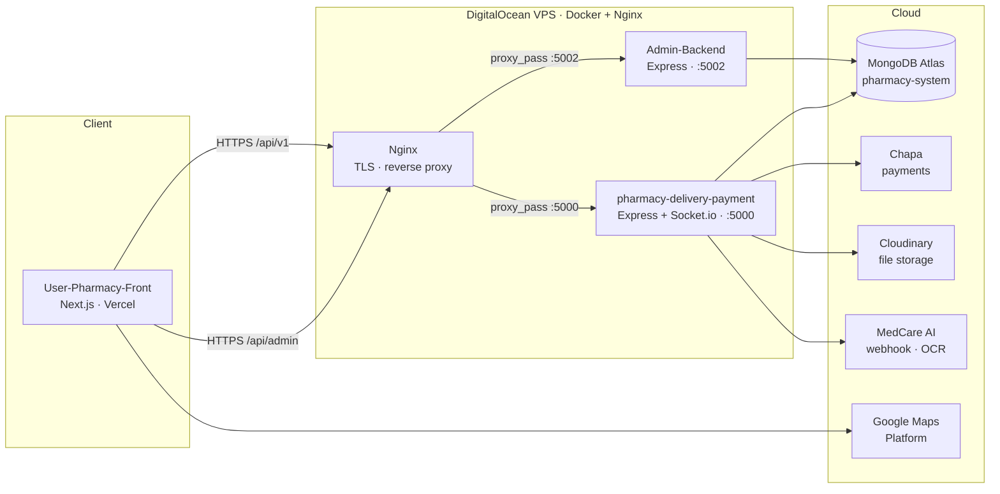
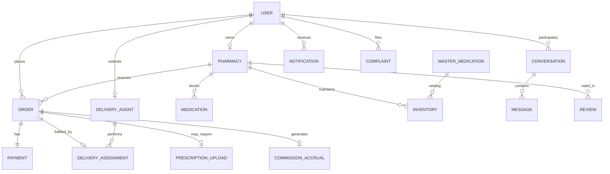

<p align="center">
  <strong>MED-CARE Ethiopia</strong><br/>
  <em>AI-powered healthcare navigation &amp; pharmacy delivery platform</em>
</p>

<p align="center">
  <a href="#overview">Overview</a> •
  <a href="#architecture">Architecture</a> •
  <a href="#database-design">Database</a> •
  <a href="#repository-structure">Structure</a> •
  <a href="#quick-start">Quick Start</a> •
  <a href="#production-deployment">Deployment</a> •
  <a href="#testing">Testing</a>
</p>

---

## Overview

**MED-CARE Ethiopia** is a full-stack web platform that helps patients in Ethiopia find medications, locate pharmacies, place orders, pay securely, and receive home delivery. The system combines a **Next.js** frontend, **two Node.js backend services**, and a **shared MongoDB Atlas** database in a single monorepo.

| Capability          | Description                                                                                         |
| ------------------- | --------------------------------------------------------------------------------------------------- |
| **Patient portal**  | Search medicines, browse pharmacies on a map, cart & checkout, track orders, chat, health assistant |
| **Pharmacy portal** | Inventory, order fulfillment, prescription verification, commission payments                        |
| **Delivery portal** | Assignments, delivery steps, COD handling, proof of delivery                                        |
| **Admin portal**    | License verification, user/pharmacy/driver management, analytics, health alerts, audit logs         |
| **Payments**        | [Chapa](https://chapa.co) gateway (Telebirr, CBE Birr, eBirr, etc.) + cash on delivery              |
| **Languages**       | English & Amharic UI support                                                                        |

**Final-year project** — Addis Ababa Science and Technology University (AASTU), Software Engineering

---

## Architecture

Modular **service-oriented monorepo**: two REST APIs, one Next.js frontend, one shared MongoDB database. The two backend services never call each other over HTTP — they share state through MongoDB collections. Both backends run as Docker containers behind an **Nginx** reverse proxy on a **DigitalOcean VPS**, with TLS termination and path-based routing.



**Nginx** handles TLS, routes `/api/admin` to the Admin Backend and `/api/v1` to the Med API, and adds security headers. Both containers share a `medcare-network` Docker bridge.

| Layer      | Technology                                                            |
| ---------- | --------------------------------------------------------------------- |
| Frontend   | Next.js 15, React 19, TypeScript, Tailwind CSS, Radix UI, Google Maps |
| Med API    | Express, TypeScript, Mongoose, Socket.io, Cloudinary, Chapa           |
| Admin API  | Express, TypeScript, Mongoose, JWT + refresh, Resend/SMTP, Jest       |
| Database   | MongoDB Atlas — database `pharmacy-system`                            |
| Real-time  | Socket.io (messaging, delivery location)                              |
| Production | Vercel (frontend) · DigitalOcean VPS + Docker + **Nginx** (backends)  |

---

## Database Design

Single **MongoDB** database (`pharmacy-system`) shared by both backend services. All access is via **Mongoose** schemas with role-based API middleware — no direct database-level RLS.

### Collections at a glance

| Collection            | Primary service | Purpose                                                                                               |
| --------------------- | --------------- | ----------------------------------------------------------------------------------------------------- |
| `users`               | Both            | All roles: `patient`, `pharmacy`, `delivery`, `admin`. Unique indexes on `email`, `phone`, `username` |
| `pharmacies`          | Both            | Business profile, geo `2dsphere` index, license details, verification status                          |
| `hospitals`           | Both            | Static hospital directory with `2dsphere` geo index                                                   |
| `medications`         | Both            | Per-pharmacy drug catalog with stock, price, expiry                                                   |
| `mastermedications`   | Med API         | Platform-wide drug catalog (EN/AM names)                                                              |
| `inventories`         | Med API         | Many-to-many: `Pharmacy` ↔ `MasterMedication` with local pricing                                      |
| `orders`              | Both            | Full order lifecycle — 7-stage status history, embedded `items[]`, prescription workflow              |
| `payments`            | Both            | Chapa / COD transactions. **Unique** `orderId` — one payment per order                                |
| `deliveryagents`      | Both            | Driver profile; `_id` matches the delivery `User._id` (shared identity)                               |
| `deliveryassignments` | Admin-Backend   | One per order (**unique** `orderId`), snapshot of addresses and medications at assignment time        |
| `deliveryearnings`    | Admin-Backend   | Per-assignment earnings for drivers                                                                   |
| `conversations`       | Both            | Chat threads with `participants[]` and `lastMessage` denormalized                                     |
| `messages`            | Both            | Messages linked to a `Conversation`                                                                   |
| `notifications`       | Both            | In-app alerts triggered by order, payment, and complaint events                                       |
| `prescriptionuploads` | Both            | Image/PDF prescriptions linked to `Order` and `User`                                                  |
| `complaints`          | Both            | User-reported issues with admin resolution workflow                                                   |
| `reviews`             | Both            | Pharmacy ratings — unique compound index `(pharmacyId, patientId)`                                    |
| `commission_accruals` | Both            | Per-order platform commission owed by pharmacy                                                        |
| `commission_payments` | Both            | Pharmacy settlement payments via Chapa                                                                |
| `pharmacylicenses`    | Admin-Backend   | License verification workflow with `verificationHistory[]`                                            |
| `healthalerts`        | Both            | Admin-broadcast public health advisories                                                              |
| `auditlogs`           | Both            | Admin and operational action audit trail                                                              |
| `platformconfigs`     | Both            | Key–value system settings (commission rates, delivery radius, etc.)                                   |
| `refreshtokens`       | Admin-Backend   | Hashed admin refresh tokens                                                                           |

### Core ER relationships



### Order lifecycle (data flow)

```
Patient creates order → Order (pending)
  → Patient pays via Chapa → Payment (initiated → success)
    → Chapa webhook → Payment (success) + Notification
      → Admin assigns driver → DeliveryAssignment + Order (dispatched)
        → Driver delivers → Order (delivered) + DeliveryEarning + CommissionAccrual
```

### Key design decisions

| Decision                                         | Rationale                                                      |
| ------------------------------------------------ | -------------------------------------------------------------- |
| Single `users` collection for all roles          | One login endpoint; role field gates access                    |
| `Order.items[]` embedded                         | Line items always read with the order — avoids extra queries   |
| `DeliveryAssignment.snapshot` embedded           | Immutable copy of addresses and medications at assignment time |
| `DeliveryAgent._id` = `User._id`                 | Single identity for authentication and delivery profile        |
| `2dsphere` indexes on `pharmacies` + `hospitals` | Enables fast geospatial "find nearby" queries                  |
| Unique index on `payments.orderId`               | Enforces exactly one payment per order at database level       |

> Full field-level specification: [`docs/4.3.3-database-design.md`](docs/4.3.3-database-design.md)
> ER diagram source (dbdiagram.io): [`docs/database-design.dbml`](docs/database-design.dbml)

---

## Repository structure

```text
final_year/
├── User-Pharmacy-Front/          # Next.js web app (patients, pharmacy, delivery, admin UI)
├── pharmacy-delivery-payment/  # Med API — orders, payments, inventory, messaging
├── Admin-Backend/                # Admin API — governance, licenses, analytics
├── deploy/nginx/                 # Example Nginx config for production VPS
├── docker-compose.yml            # Run both backends on a server
└── docs/                         # Thesis & technical documentation
```

### Services at a glance

<table>
<thead>
<tr>
  <th>Service</th>
  <th>Folder</th>
  <th>Default port</th>
  <th>API prefix</th>
  <th>Package manager</th>
</tr>
</thead>
<tbody>
<tr>
  <td><strong>Frontend</strong></td>
  <td><code>User-Pharmacy-Front</code></td>
  <td><code>3000</code></td>
  <td>—</td>
  <td>npm</td>
</tr>
<tr>
  <td><strong>Med API</strong></td>
  <td><code>pharmacy-delivery-payment</code></td>
  <td><code>5000</code></td>
  <td><code>/api/v1</code></td>
  <td>npm</td>
</tr>
<tr>
  <td><strong>Admin API</strong></td>
  <td><code>Admin-Backend</code></td>
  <td><code>5002</code></td>
  <td><code>/api/admin</code></td>
  <td>pnpm</td>
</tr>
</tbody>
</table>

---

## Features by role

<details>
<summary><strong>Patient</strong></summary>

- Register / login with JWT
- Search medications and nearby pharmacies (maps)
- Cart, checkout, Chapa or COD
- Order tracking and notifications
- Conversations with pharmacy
- Prescription upload
- Hospital directory, health alerts, complaints, reviews

</details>

<details>
<summary><strong>Pharmacy</strong></summary>

- Store profile, hours, delivery settings
- Medication & inventory management (CSV bulk upload)
- Accept/reject and fulfill orders
- Prescription verification
- Commission accrual & settlement via Chapa
- Messaging with patients

</details>

<details>
<summary><strong>Delivery agent</strong></summary>

- Profile linked to pharmacy (`DeliveryAgent` collection)
- Delivery assignments and step workflow
- COD collection and delivery proof
- Earnings stats

</details>

<details>
<summary><strong>Administrator</strong></summary>

- 54+ REST endpoints (dashboard, analytics, reports)
- Pharmacy license verification workflow
- User / pharmacy / driver management
- Order & delivery oversight, complaints, payments
- Disease / health alerts, platform settings, audit logs
- Optional MFA (TOTP), email via Resend

</details>

---

## Quick start

### Prerequisites

- **Node.js** 18+
- **MongoDB** 6+ (local) or **MongoDB Atlas** connection string
- **pnpm** (Admin-Backend) and **npm** (other packages)
- Optional: **Docker** & **Docker Compose** for containerized backends

### 1. Clone

```bash
git clone https://github.com/teklumt/MEDCARE-backend.git
cd MEDCARE-backend   # or your local folder name: final_year
```

### 2. Database

Both backends use the **same** database name: `pharmacy-system`.

```env
# Admin-Backend/.env
MONGO_URI=mongodb://127.0.0.1:27017/pharmacy-system

# pharmacy-delivery-payment/.env
MONGODB_URI=mongodb://127.0.0.1:27017/pharmacy-system
```

For Atlas, use your `mongodb+srv://...` URI in both files.

### 3. Configure environment

Copy examples and fill in secrets:

```bash
cp Admin-Backend/.env.example Admin-Backend/.env
cp pharmacy-delivery-payment/.env.example pharmacy-delivery-payment/.env
cp User-Pharmacy-Front/.env.production.example User-Pharmacy-Front/.env.local
```

**Frontend local defaults** (`User-Pharmacy-Front/.env.local`):

```env
NEXT_PUBLIC_API_URL=http://localhost:5000/api/v1
NEXT_PUBLIC_ADMIN_API_BASE_URL=http://localhost:5002/api/admin
NEXT_PUBLIC_GOOGLE_MAPS_API_KEY=your_google_maps_key
```

> Med API runs on **5000** locally; Admin API on **5002** (see `Admin-Backend/.env.example`).

### 4. Install & run (development)

**Terminal 1 — Admin API**

```bash
cd Admin-Backend
pnpm install
pnpm dev
# http://localhost:5002/health
```

**Terminal 2 — Med API**

```bash
cd pharmacy-delivery-payment
npm install
npm run dev
# http://localhost:5000/health
```

**Terminal 3 — Frontend**

```bash
cd User-Pharmacy-Front
npm install
npm run dev
# http://localhost:3000
```

### 5. Seed sample data (optional)

```bash
cd Admin-Backend
pnpm run seed
```

| Role        | Email                       | Password         |
| ----------- | --------------------------- | ---------------- |
| Super Admin | `superadmin@medcare-et.com` | `Admin@12345`    |
| Admin       | `admin@medcare-et.com`      | `Admin@12345`    |
| Patient     | `abel.user@medcare-et.com`  | `User@12345`     |
| Pharmacy    | `pharmacy1@medcare-et.com`  | `Pharmacy@12345` |
| Delivery    | `driver1@medcare-et.com`    | `Driver@12345`   |

### 6. Docker (both backends)

From the repository root:

```bash
docker compose up -d --build
```

| Service   | Host URL                                              |
| --------- | ----------------------------------------------------- |
| Admin API | `http://localhost:5000` (maps to container port 5002) |
| Med API   | `http://localhost:5001` (maps to container port 5000) |

Ensure `Admin-Backend/.env` and `pharmacy-delivery-payment/.env` exist before compose.

---

## Production deployment

| Component | Platform                                      |
| --------- | --------------------------------------------- |
| Frontend  | **Vercel**                                    |
| Backends  | **DigitalOcean** droplet — Docker + **Nginx** |
| Database  | **MongoDB Atlas**                             |

### Public API URLs

| Service       | Base URL                                      |
| ------------- | --------------------------------------------- |
| **Med API**   | `https://pharmacy.64.227.2.138.nip.io/api/v1` |
| **Admin API** | `https://admin.64.227.2.138.nip.io/api/admin` |

**Health checks**

```bash
curl https://pharmacy.64.227.2.138.nip.io/health
curl https://admin.64.227.2.138.nip.io/health
```

**Vercel environment variables**

```env
NEXT_PUBLIC_API_URL=https://pharmacy.64.227.2.138.nip.io/api/v1
NEXT_PUBLIC_ADMIN_API_BASE_URL=https://admin.64.227.2.138.nip.io/api/admin
```

**Chapa webhook (Med API)**

```env
CHAPA_CALLBACK_URL=https://pharmacy.64.227.2.138.nip.io/api/v1/payments/chapa/webhook
API_URL=https://pharmacy.64.227.2.138.nip.io
FRONTEND_URL=https://your-app.vercel.app
```

Nginx example: [`deploy/nginx/medcare.conf.example`](deploy/nginx/medcare.conf.example)

---

## API overview

### Med API (`pharmacy-delivery-payment`)

| Area                          | Base path                                     |
| ----------------------------- | --------------------------------------------- |
| Auth                          | `/api/v1/auth`                                |
| Users                         | `/api/v1/users`                               |
| Pharmacies                    | `/api/v1/pharmacies`, `/api/v1/pharmacy`      |
| Medications & search          | `/api/v1/medications`, `/api/v1/search`       |
| Orders & payments             | `/api/v1/orders`, `/api/v1/payments`          |
| Delivery                      | `/api/v1/delivery`                            |
| Messaging                     | `/api/v1/conversations`                       |
| Hospitals, alerts, complaints | `/api/v1/hospitals`, `alerts`, `complaints`   |
| Prescriptions, AI             | `/api/v1/prescriptions`, `/api/v1/medcare-ai` |
| Commission, notifications     | `/api/v1/commission`, `/api/v1/notifications` |

Discovery: `GET /api/v1` · Postman: `pharmacy-delivery-payment/postman_collection.json`

### Admin API (`Admin-Backend`)

| Area                            | Base path                                                 |
| ------------------------------- | --------------------------------------------------------- |
| Auth                            | `/api/admin/auth`                                         |
| Dashboard                       | `/api/admin/`                                             |
| Licenses                        | `/api/admin/licenses`, `/api/admin/verifications`         |
| Users, pharmacies, drivers      | `/api/admin/users`, `pharmacies`, `drivers`               |
| Orders, deliveries, payments    | `/api/admin/orders`, `deliveries`, `payments`             |
| Analytics, complaints, settings | `/api/admin/analytics`, `complaints`, `platform-settings` |

Postman: `Admin-Backend/postman/`

---

## Environment variables (reference)

<details>
<summary><strong>Admin-Backend</strong></summary>

| Variable                                     | Description                                |
| -------------------------------------------- | ------------------------------------------ |
| `MONGO_URI`                                  | MongoDB connection (Atlas or local)        |
| `PORT`                                       | Server port (default `5002`)               |
| `JWT_ACCESS_SECRET` / `JWT_REFRESH_SECRET`   | Token signing                              |
| `CORS_ORIGIN`                                | Allowed frontend origins (comma-separated) |
| `RESEND_API_KEY` / `SMTP_*`                  | Email delivery                             |
| `SUPER_ADMIN_EMAIL` / `SUPER_ADMIN_PASSWORD` | Bootstrap super admin on start             |

</details>

<details>
<summary><strong>pharmacy-delivery-payment</strong></summary>

| Variable                            | Description                        |
| ----------------------------------- | ---------------------------------- |
| `MONGODB_URI`                       | MongoDB connection                 |
| `PORT`                              | Server port (default `5000`)       |
| `JWT_SECRET` / `JWT_REFRESH_SECRET` | Auth tokens                        |
| `CHAPA_*`                           | Payment keys, mode, webhook secret |
| `CHAPA_CALLBACK_URL`                | Public webhook URL                 |
| `API_URL`                           | Public API base (for callbacks)    |
| `FRONTEND_URL`                      | Vercel app URL                     |
| `CLOUDINARY_*`                      | File uploads                       |
| `MEDCARE_AI_WEBHOOK_URL`            | Optional AI chat webhook           |
| `PRESCRIPTION_SCAN_WEBHOOK_URL`     | Optional OCR webhook               |

</details>

<details>
<summary><strong>User-Pharmacy-Front</strong></summary>

| Variable                          | Description                           |
| --------------------------------- | ------------------------------------- |
| `NEXT_PUBLIC_API_URL`             | Med API base including `/api/v1`      |
| `NEXT_PUBLIC_ADMIN_API_BASE_URL`  | Admin API base including `/api/admin` |
| `NEXT_PUBLIC_GOOGLE_MAPS_API_KEY` | Maps & geocoding                      |

</details>

---

## Testing

The project has **275 automated tests** across all three repositories.

| Repository | Framework | Test files | Tests |
| --- | --- | --- | --- |
| `Admin-Backend` | Jest + Supertest (ESM) | 14 | **155** |
| `pharmacy-delivery-payment` | Jest + Supertest (CJS) | 9 | **63** |
| `User-Pharmacy-Front` | Jest (utility logic) | 5 | **57** |
| **Total** | | **28** | **275** |

### Admin-Backend — 155 tests

```bash
cd Admin-Backend
pnpm test          # run all 155 tests
pnpm test:watch    # watch mode with interactive filter
```

| Test file | Tests | Module |
| --- | --- | --- |
| `auth.test.ts` | 34 | Login, MFA, registration (patient / pharmacy / delivery), password reset |
| `admin-management.test.ts` | 16 | Create, list, update role, suspend, delete admin accounts |
| `analytics.test.ts` | 16 | Overview, users, orders, drivers, traffic, alerts analytics |
| `misc-management.test.ts` | 14 | Orders, deliveries, payments, drivers, audit logs |
| `pharmacies.test.ts` | 11 | List, suspend, activate, badge toggle |
| `alerts.test.ts` | 11 | Create, list, deactivate disease alerts |
| `licenses.test.ts` | 10 | Approve, reject, revoke pharmacy licenses |
| `dashboard.test.ts` | 8 | Platform stats, system health |
| `users.test.ts` | 8 | List, deactivate, activate, filter users |
| `platform-settings.test.ts` | 7 | Get/update platform config, maintenance mode |
| `complaints.test.ts` | 7 | List, resolve, filter complaints |
| `auth-guard.test.ts` | 5 | Blocks unauthenticated + malformed tokens |
| `public.test.ts` | 5 | Public pharmacy list (no auth) |
| `health.test.ts` | 3 | Health check endpoint |

### pharmacy-delivery-payment — 63 tests

```bash
cd pharmacy-delivery-payment
npm test           # run all 63 tests
npm run test:watch
```

| Test file | Tests | Module |
| --- | --- | --- |
| `orders.test.ts` | 12 | Create, list, get, status update, cancel, tracking, role guards |
| `delivery.test.ts` | 10 | Profile, status, assigned orders, history, earnings, location update |
| `complaints.test.ts` | 8 | Create, list, get by ID, role guards |
| `payments.test.ts` | 7 | Chapa initiate, webhook, get by ID, verify |
| `hospitals.test.ts` | 6 | List, get by ID, 404, public access |
| `auth.test.ts` | 9 | Patient/pharmacy/delivery signup, login, refresh, logout guard |
| `health.test.ts` | 5 | Health endpoint, 404, API info |
| `search.test.ts` | 4 | Medication search, missing query validation |
| `notifications.test.ts` | 2 | List notifications, auth guard |

### User-Pharmacy-Front — 57 tests

```bash
cd User-Pharmacy-Front
npm test           # run all 57 tests
npm run test:watch
```

| Test file | Tests | Module |
| --- | --- | --- |
| `utils/analytics.test.ts` | 14 | Revenue totals, top months, avg order value, top medications chart |
| `utils/pharmacy.test.ts` | 14 | Distance calc, stock badges, delivery fee, open hours, ratings |
| `utils/order.test.ts` | 11 | Status labels, cancellation rules, total calculation, progress % |
| `utils/language.test.ts` | 9 | EN/AM translations, completeness, unsupported locale guard |
| `utils/auth.test.ts` | 9 | Email validation, password strength, Ethiopian phone format |

---

## Integrations

| Service                                                        | Used for                          |
| -------------------------------------------------------------- | --------------------------------- |
| [Chapa](https://chapa.co)                                      | Patient & pharmacy payments       |
| [Cloudinary](https://cloudinary.com)                           | Prescriptions, uploads            |
| [Resend](https://resend.com) / SMTP                            | Admin transactional email         |
| [Google Maps Platform](https://cloud.google.com/maps-platform) | Pharmacy map & geocoding          |
| External webhooks                                              | Prescription OCR, MedCare AI chat |

---

---

## License

Contact the team before commercial use.

---

<p align="center">
  <sub>Built for healthcare access in Ethiopia · MED-CARE Ethiopia</sub>
</p>
